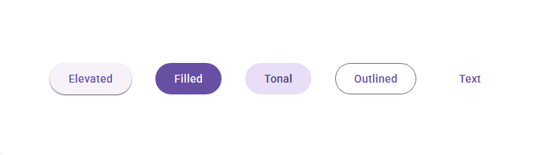

# Buttons

**Buttons prompt most actions in a UI**



## Usage

```python
from material_ui.buttons import ElevatedButton

button = ElevatedButton()
button.text = "Hello"
button.clicked.connect(lambda: print("Clicked!"))
```

## API

### Properties

| Name   | Type  | Description             |
| ------ | ----- | ----------------------- |
| `text` | `str` | Text inside the button. |

### Signals

| Name      | Description                         |
| --------- | ----------------------------------- |
| `clicked` | Emitted when the button is clicked. |
