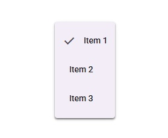

# Menu

**Menus display a list of choices on a temporary surface**



## Usage

```python
from material_ui.menu import Menu, MenuItem

menu = Menu()
MenuItem(parent=menu, text="Item 1", on_click=lambda: print("Item 1 clicked"))
MenuItem(parent=menu, text="Item 2", on_click=lambda: print("Item 2 clicked"))
MenuItem(parent=menu, text="Item 3", on_click=lambda: print("Item 3 clicked"))
menu.open()
```

## API

### Properties

| Name | Type | Default | Description |
| ---- | ---- | ------- | ----------- |

### Signals

| Name | Arguments | Description |
| ---- | --------- | ----------- |
