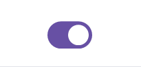

# Switch

**Switches toggle the selection of an item on or off**



## Usage

```python
from material_ui import Switch

switch = Switch()
```

## API

### Properties

| Name       | Type   | Description                      |
| ---------- | ------ | -------------------------------- |
| `selected` | `bool` | Whether the switch is on or off. |

### Signals

| Name               | Description                                                  |
| ------------------ | ------------------------------------------------------------ |
| `change_requested` | Emitted when the user toggles the switch. |

## Controlled Switch

A controlled switch has its state managed by the parent component. For more information on controlled components, see [Controlled Components](https://reactjs.org/docs/forms.html#controlled-components).

```python
from material_ui import use_state, Component, Switch

class MyComponent(Component):
    is_selected = use_state(False)

    def __init__(self):
        super().__init__()

        self.switch = Switch()
        self.switch.selected.bind(self.is_selected)
        self.switch.change_requested.connect(self.is_selected.set)
```
